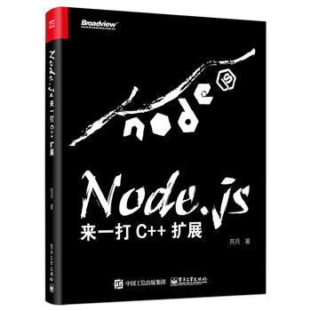

# 《Node.js：来一打 C++ 扩展》随书源码



[English Document](README_en.md)

本仓库为死月所著《Node.js：来一打 C++ 扩展》的随书源码，大家尽情享用。

> **注意**：所有的随书代码均在 macOS 命令行下 Node.js 6.x 测试通过。理论上，它们也可以在 Windows 和 UNIX 上运行良好，但我并没有验证过。

## 下载

本源码可从博文视点官方网站上下载。如果你对 [Git](https://git-scm.com/) 熟悉，且愿意使用 Git 克隆本仓库使用源码，非常欢迎。

如果需要克隆本仓库，可以使用以下命令行：

```shell
$ git clone https://github.com/XadillaX/nyaa-nodejs-demo.git --recurse-submodules
```

> `--recurse-submodules` 参数允许你连通 submodule 一起克隆下来。
>
> 由于 GitHub 的特性，如果你直接从 GitHub 的本页面上直接通过 **Download ZIP** 链接下载压缩包，将不会包含一些必要依赖的 submodule。所以如果你想通过压缩包下载的形式获取源码，请转到博文视点官方网站。

## 快速导航

1. [first build](https://github.com/XadillaX/nyaa-nodejs-demo/tree/master/1.%20first%20build)：「1.4.2. node-gyp」
2. [cpp entry](https://github.com/XadillaX/nyaa-nodejs-demo/tree/master/2.%20cpp%20entry)：「2.2.2. Node.js 模块加载原理」
3. [function template](https://github.com/XadillaX/nyaa-nodejs-demo/tree/master/3.%20function%20template)：「3.6.1. 函数模板（Function Template）」
4. [object template](https://github.com/XadillaX/nyaa-nodejs-demo/tree/master/4.%20object%20template)：「3.6.2. 对象模板（Object Template）」
5. [object template accessor](https://github.com/XadillaX/nyaa-nodejs-demo/tree/master/5.%20object%20template%20accessor)：「3.6.3. 对象模板的访问器（Accessor）与拦截器（Interceptor）」
6. [mapped property interceptor](https://github.com/XadillaX/nyaa-nodejs-demo/tree/master/6.%20mapped%20property%20interceptor)：「3.6.3. 对象模板的访问器（Accessor）与拦截器（Interceptor）」
7. [indexed property interceptor](https://github.com/XadillaX/nyaa-nodejs-demo/tree/master/7.%20indexed%20property%20interceptor)：「3.6.3. 对象模板的访问器（Accessor）与拦截器（Interceptor）」
8. [internal field wrong](https://github.com/XadillaX/nyaa-nodejs-demo/tree/master/8.%20internal%20field%20wrong)：「3.6.4. 对象模板的内置字段（Internal Field）」
9. [internal field right](https://github.com/XadillaX/nyaa-nodejs-demo/tree/master/9.%20internal%20field%20right)：「3.6.4. 对象模板的内置字段（Internal Field）」
10. [function template inherit](https://github.com/XadillaX/nyaa-nodejs-demo/tree/master/10.%20function%20template%20inherit)：「3.6.5. 函数模板的继承（Inherit）」
11. [array prototype map](https://github.com/XadillaX/nyaa-nodejs-demo/tree/master/11.%20array%20prototype%20map)：「3.7.6. 函数（Function）」
12. [try catch](https://github.com/XadillaX/nyaa-nodejs-demo/tree/master/12.%20try%20catch)：「3.8.1. Try-Catch」
13. [hello world again](https://github.com/XadillaX/nyaa-nodejs-demo/tree/master/13.%20hello%20world%20again)：「4.2.1. 又是 Hello World」
14. [function parameters](https://github.com/XadillaX/nyaa-nodejs-demo/tree/master/14.%20function%20parameters)：「4.2.2. 函数参数」
15. [run callback](https://github.com/XadillaX/nyaa-nodejs-demo/tree/master/15.%20run%20callback)：「4.2.3. 回调函数」
16. [object factory](https://github.com/XadillaX/nyaa-nodejs-demo/tree/master/16.%20object%20factory)：「4.2.4. 对象返回」
17. [function factory](https://github.com/XadillaX/nyaa-nodejs-demo/tree/master/17.%20function%20factory)：「4.2.5. 函数返回」
18. [myobject](https://github.com/XadillaX/nyaa-nodejs-demo/tree/master/18.%20myobject)：「4.3.1. C++ 与 JavaScript 类封装」
19. [at_exit_hook](https://github.com/XadillaX/nyaa-nodejs-demo/tree/master/19.%20at_exit_hook)：「4.3.4. 进程退出钩子」
20. [nan echo](https://github.com/XadillaX/nyaa-nodejs-demo/tree/master/20.%20nan%20echo)：「5.2.3. 来不及解释了，先上车」
21. [nan array prototype map](https://github.com/XadillaX/nyaa-nodejs-demo/tree/master/21.%20nan%20array%20prototype%20map)：「5.2.4. 基础帮助函数和宏」
22. [nan set method](https://github.com/XadillaX/nyaa-nodejs-demo/tree/master/22.%20nan%20set%20method)：「5.3.3. 函数设置」
23. [nan reverse string](https://github.com/XadillaX/nyaa-nodejs-demo/tree/master/23.%20nan%20reverse%20string)：「5.4.3. 与数据对象“玩耍”」
24. [nan object demo](https://github.com/XadillaX/nyaa-nodejs-demo/tree/master/24.%20nan%20object%20demo)：「5.4.3. 与数据对象“玩耍”」
25. [nan array demo](https://github.com/XadillaX/nyaa-nodejs-demo/tree/master/25.%20nan%20array%20demo)：「5.4.3. 与数据对象“玩耍”」
26. [nan json](https://github.com/XadillaX/nyaa-nodejs-demo/tree/master/26.%20nan%20json)：「5.4.3. 与数据对象“玩耍”」
27. [nan buffer](https://github.com/XadillaX/nyaa-nodejs-demo/tree/master/27.%20nan%20buffer)：「5.4.3. 与数据对象“玩耍”」
28. [nan nbodies](https://github.com/XadillaX/nyaa-nodejs-demo/tree/master/28.%20nan%20nbodies)：「5.5.3. Nan::AsyncWorker」
29. [nan dummy download](https://github.com/XadillaX/nyaa-nodejs-demo/tree/master/29.%20nan%20dummy%20download)：「5.5.4. Nan::AsyncProgressWorker」
30. [libuv idle](https://github.com/XadillaX/nyaa-nodejs-demo/tree/master/30.%20libuv%20idle)：「6.1.3. 尝个甜头」
31. [libuv sleep sort](https://github.com/XadillaX/nyaa-nodejs-demo/tree/master/31.%20libuv%20sleep%20sort)：「6.2.1. libuv 的线程」
32. [libuv sleep sort advanced](https://github.com/XadillaX/nyaa-nodejs-demo/tree/master/32.%20libuv%20sleep%20sort%20advanced)：「6.2.2. 同步原语（Synchronization Primitives）」
33. [libuv watchdog](https://github.com/XadillaX/nyaa-nodejs-demo/tree/master/33.%20libuv%20watchdog)：「6.3.2. Watchdog 半成品实战解析」
34. [efsw](https://github.com/XadillaX/nyaa-nodejs-demo/tree/master/34.%20efsw)：「7.1.1. 功能规划」
35. [efsw advanced](https://github.com/XadillaX/node-efsw/tree/85cc5b816c3e04b4df92f63592f5e9ce99808418)：「7.4.2. JavaScript 代码完善」
36. [napi](https://github.com/XadillaX/nyaa-nodejs-demo/tree/master/36.%20napi)：「9.1.1. 实现一个 `Echo` 函数」

## 购书链接

+ [京东](https://item.jd.com/12380404.html)
+ [天猫](https://detail.tmall.com/item.htm?id=571628730908&cat_id=2)
+ [当当](http://product.dangdang.com/25291814.html)
+ [亚马逊](https://www.amazon.cn/dp/B07DL8GHQC/ie=UTF8&qid=1528969734)
+ [china-pub](http://product.china-pub.com/8039217)
+ [豆瓣](https://book.douban.com/subject/30247892/)（不算购书链接）

## QQ 交流群


## 感谢阅读

最后，感谢大家支持本书。


<center><font color="gray"><small>图片来自 <a target="_blank" href="https://www.pixiv.net/member_illust.php?mode=medium&illust_id=35873732">Pixiv</a></small></font></center>
